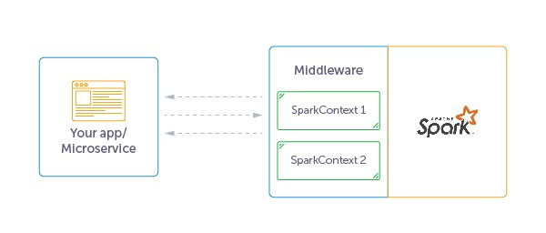

# Problem Definition

The goal of this document is to define the architectural guidelines for building a micro-service to expose analytics and 
data as a service on top of Apache Spark.

After reading this doc it will be clear how:

1. Architecturally connect a big data stack with micro-services
2. provide a stable and resilient orchestration of Apache Spark programs


## Spark as a Service

Given the distinction between big data stack and micro-services backend. Data Scientist are used to work with SQL and Spark
while Web Developer prefer to use REST and HTTP, to hide the complexity of the big data processing.

To bring both together we need a middleware that receive requests from a web application, execute Spark programs and return the results.

Here there challenges to face:

1. Reliability: the design should take care of managing concurrent requests coming from multiple users (multi-tenant) and applications handling authorization.
2. Isolation: we need to run jobs in a multi-user framework, where each user has its authorization and permissions.
2. Interoperability: we need a unified API to run ad-hoc fast, long running and streaming jobs and then consumer their results.

### Reliability

In Spark terminology it means that you should be able to run different jobs using different [Spark Contexts](https://spark.apache.org/docs/2.1.1/programming-guide.html#initializing-spark).
A SparkContext represents the connection to a Spark cluster, and can be used to create RDDs, accumulators and broadcast variables on that cluster.
Only one SparkContext may be active per JVM. You must stop() the active SparkContext before creating a new one. 
This limitation will not be removed as described in [SPARK-2243](https://issues.apache.org/jira/browse/SPARK-2243).

In Spark 2.0 was introduced the new concept of [SparkSession](https://databricks.com/blog/2016/08/15/how-to-use-sparksession-in-apache-spark-2-0.html).
You can have multiple SparkSessions but still there are all related to the same SparkContext. 

> Add section to evaluate how multiple session works in case of user impersonation

#### Context pool

SparkContext is expensive in terms of performance. So, in order to provide instant job execution it is useful to maintain 
a [pool](https://github.com/twitter/util#object-pool) of SparkContexts using multiple JVM,
 
 > or alternatively a create different sessions per request.



### Isolation

One of the desiderata is to run run different kind of Spark Jobs for different users with a guarantee of isolation.
This is particularly important when you need to access to HDFS resources with ACL rules. Spark enables this feature with 
[Proxy Users](https://hadoop.apache.org/docs/r2.7.1/hadoop-project-dist/hadoop-common/Superusers.html).
Where a super user can run jobs on behalf of other users.

```java

    ...
    //Create ugi for joe. The login user is 'super'.
    UserGroupInformation ugi =
            UserGroupInformation.createProxyUser("joe", UserGroupInformation.getLoginUser());
    ugi.doAs(new PrivilegedExceptionAction<Void>() {
      public Void run() throws Exception {
        //Submit a job
        JobClient jc = new JobClient(conf);
        jc.submitJob(conf);
        //OR access hdfs
        FileSystem fs = FileSystem.get(conf);
        fs.mkdir(someFilePath);
      }
    }
```

What we need to investigate is how this feature works in case of jobs ran using the same SparkContext.

[The author of this posts](https://medium.com/@stepanpushkarev/architecting-smart-applications-on-top-of-apache-spark-b0fcab6ea400) 
recommended to create them in different JVMs or Docker Containers. The middleware have to manage these SparkContexts,
and interact with micro-services and the spark cluster. 
But we need to investigate how it works in conjunction of proxy-users.


### Interoperability

The frontend should expose the data in JSON format as basis and then it can use binary formats such as BSON or others.

So what options do we have to expose this data model?

- HTTP API
- Messaging API
- Reactive API
- Shared database


#### HTTP API

There are several projects trying to create a middleware to interact with Apache Spark.
Most of them provide the ability to trigger a Spark job with an HTTP request and retrieve the results.
 
However there are significant differences:
 
- [Hydrosphere Mist](https://github.com/Hydrospheredata/mist) provides a low level APIs to handle different types of applications.

- [Spark-Jobserver](https://github.com/spark-jobserver/spark-jobserver) provides a rest API for jobs, with separate JVMs support and other [features](https://github.com/spark-jobserver/spark-jobserver).

- [Apache Livy](https://livy.incubator.apache.org/) allows to send code interactively or submit/monitor jobs, but it is isn't mature as the projects above.

- [Apache Toree](https://github.com/apache/incubator-toree) is an IPython protocol based middleware for interactive applications

##### Hydrosphere Mist

Mist offers a scala, java and python library to create **functions** that can be executed on a spark cluster. It offers [Http api](https://hydrosphere.io/mist-docs/http_api.html)
to:
- handle functions CRUD and run job based on a function
- handle jobs, list all jobs, get info, logs and cancel
- handle workers
- handle contexts

Moreover, it offers reactive api to listen for functions submissions updates via kafka or MQTT.

**How Mist invokes functions?**

To create a new jobs you have to do the following steps:

- assign id fo job. For example if you use http:

```sh
$ curl -d '{"numbers": [1, 2, 3]}' "http://localhost:2004/v2/api/functions/spark-ctx-example/jobs"
# response:
# {"id":"2a1c90c5-8eb7-4bde-84a2-d176147fc24f"}
```
- validate input parameters locally. If they fit for target function job will be queued, otherwise job will be failed
- check and prepare worker:
    - shared - check that there is worker app exists or spawn them
    - exclusive - always spawn new worker
  Possible problems: a new worker creation has default creation timeout(see configuration). If worker wasn’t registered on master during that timeout, job will be failed.

- transmit function artifact to worker(jar/py)
- invoke function. status turns into started and then after compeletion finished or failed

Of course everything can be managed via a UI available at `http://localhost:2004/ui`. Check the [quick start](https://hydrosphere.io/mist-docs/quick_start.html) for more details.

##### Spark-JobServer

This is a project started from [Ooyala](https://github.com/ooyala) and then promoted as OS project.
It is adopted by [several companies](https://github.com/spark-jobserver/spark-jobserver#users).


- "Spark as a Service": Simple REST interface (including HTTPS) for all aspects of job, context management
- Support for Spark SQL, Hive, Streaming Contexts/jobs and custom job contexts! See Contexts.
- Python, Scala, and Java (see TestJob.java) support
- LDAP Auth support via Apache Shiro integration
- Separate JVM per SparkContext for isolation (EXPERIMENTAL)
- Supports sub-second low-latency jobs via long-running job contexts
- Start and stop job contexts for RDD sharing and low-latency jobs; change resources on restart
- Kill running jobs via stop context and delete job
- Separate jar uploading step for faster job startup
- Asynchronous and synchronous job API. Synchronous API is great for low latency jobs!
- Works with Standalone Spark as well on cluster, Mesos, YARN client and on EMR)
- Job and jar info is persisted via a pluggable DAO interface
- Named Objects (such as RDDs or DataFrames) to cache and retrieve RDDs or DataFrames by name, improving object sharing and reuse among jobs.
- Supports Scala 2.10 and 2.11

The easiest way to get started is to try the [Docker container](https://github.com/spark-jobserver/spark-jobserver#getting-started-with-spark-job-server) 
which prepackages a Spark distribution with the job server and lets you start and deploy it.

Similarly to Hydrosphere Mist you need to post:

- upload your job/function created as explained [here](https://github.com/spark-jobserver/spark-jobserver#create-a-job-server-project)
- execute the job using the rest http loading external data, which returns the uid 
- then you can query the uid to get the status of the job and the result.

```
curl localhost:8090/jobs/5453779a-f004-45fc-a11d-a39dae0f9bf4
{
  "duration": "6.341 secs",
  "classPath": "spark.jobserver.WordCountExample",
  "startTime": "2015-10-16T03:17:03.127Z",
  "context": "b7ea0eb5-spark.jobserver.WordCountExample",
  "result": {
    "a": 2,
    "b": 2,
    "c": 1,
    "see": 1
  },
  "status": "FINISHED",
  "jobId": "5453779a-f004-45fc-a11d-a39dae0f9bf4"
}⏎
```

##### Apache Livy

It allows us to submit [interactive code as string](https://livy.incubator.apache.org/docs/latest/rest-api.html) or submit 
jobs via their [programmatic api](https://livy.incubator.apache.org/docs/latest/programmatic-api.html).
It offers user impersonation, but the http endpoint does not have an authentication method.

 
#### General HTTP endpoint considerations

##### Non Blocking Api

With large data volumes and/or complex computations the pattern to block an HTTP request for at least 5 seconds isn't the best option.
It is better to use a [Messaging Broker Systems](http://queues.io/) to deliver the response to the client application.
The general idea is to submit the job, and to use the job id to listen for messages published on the messaging broker.
[Mist](https://hydrosphere.io/mist-docs/reactive_api.html) supports this feature where you can run jobs and consume job-event from Mist. 
By default it is turned off. Check out configuration to see how to turn it on.

#### Thrift Spark Endpoint

The general idea is to expose Spark with the Spark Thrift Server. In this way ApacheSpark can be used as SQL-on-Hadoop 
framework to serve your big-data as a JDBC/ODBC data source via the Spark thrift server:

- Data from multiple sources can be pushed into Spark and then exposed as SQLtable
- These tables are then made accessible as a JDBC/ODBC data source via the Spark thrift server.
- Multiple clients like Beeline CLI, JDBC, ODBC or BI tools like Tableau connect to Spark thrift server.
- Once the connection is established, ThriftServer will contact SparkSQL engine to access Hive or Spark temp tables and run the sql queries on ApacheSpark framework.
- Spark Thrift basically works similar to HiveServer2 thrift where HiveServer2 submits the sql queries as Hive MapReduce job vs Spark thrift server will use Spark SQL engine which underline uses full spark capabilities.

A running example can be found in this [repo](https://github.com/spoddutur/cloud-based-sql-engine-using-spark).
In particular, it is interesting to see the [TestThriftClient.java](https://github.com/spoddutur/cloud-based-sql-engine-using-spark/blob/master/src/test/java/TestThriftClient.java).


## Conclusions


## References

1. [Architecting smart applications on top of Apache Spark](https://medium.com/@stepanpushkarev/architecting-smart-applications-on-top-of-apache-spark-b0fcab6ea400).
2. [Building Real-time interactions with Spark](https://spoddutur.github.io/spark-notes/build-real-time-interations-with-spark.html)
3. [User impersonation in Apache Spark 1.6 Thrift Server](https://community.hortonworks.com/articles/101418/user-impersonation-in-apache-spark-16-thrift-serve.html)
4. [Row/Column-level Security in SQL for Apache Spark 2.1.1](https://community.hortonworks.com/articles/101181/rowcolumn-level-security-in-sql-for-apache-spark-2.html)
5. [Play-Spark2: A Simple Application](https://dzone.com/articles/play-spark2-a-simple-application-1)